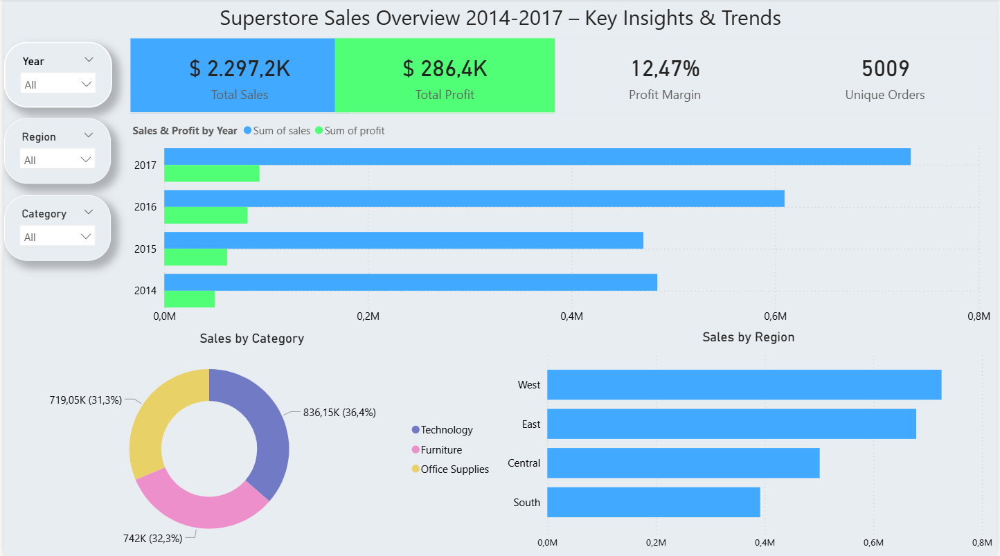
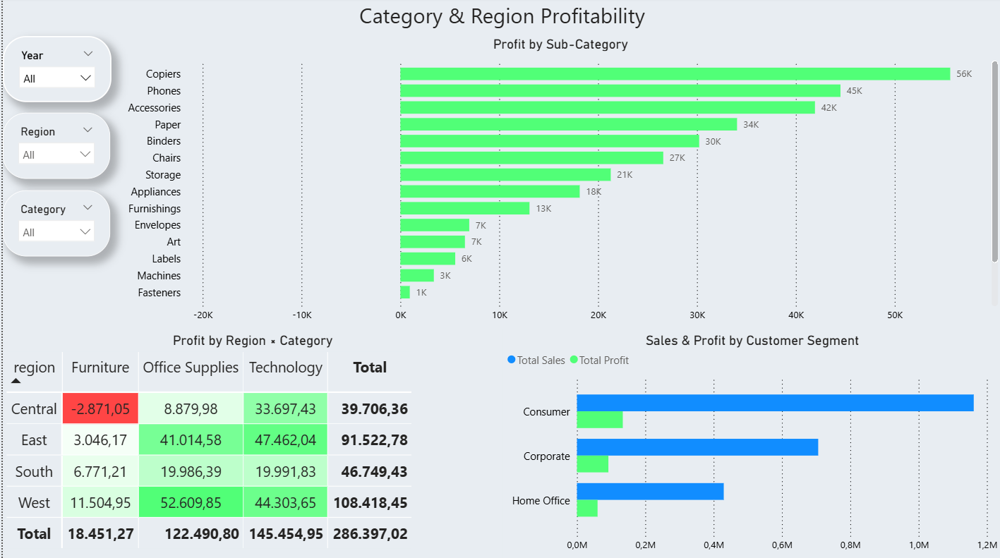
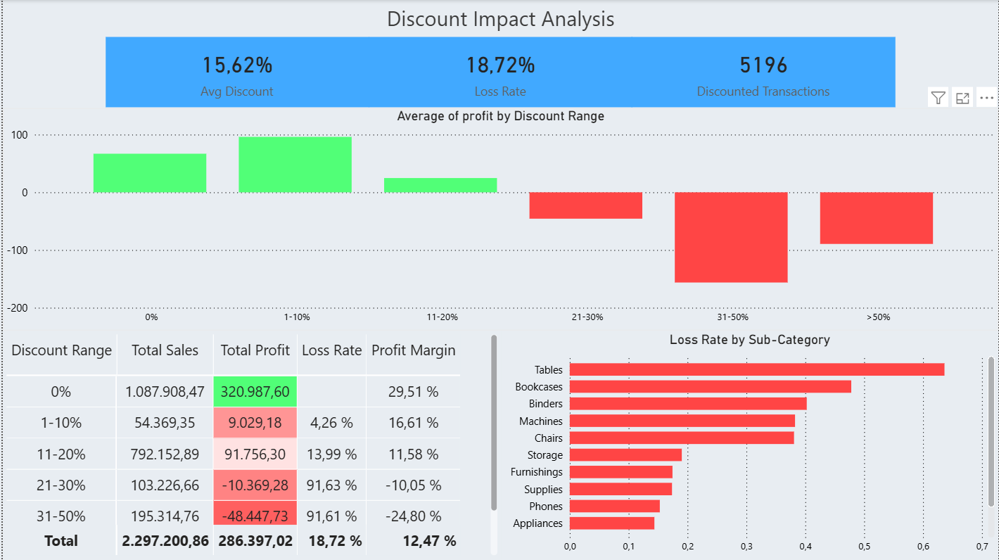

# Superstore Sales Analysis — End-to-End Data Project

**Análisis completo de ventas de una cadena retail ficticia (EE.UU.): desde la limpieza de datos hasta un dashboard interactivo con hallazgos accionables.**

> Python · SQL · Power BI · Jupyter · Pandas · Matplotlib · Seaborn

---

## Hallazgos Clave

| Hallazgo | Evidencia | Impacto |
|----------|-----------|---------|
| **Descuentos >20% generan pérdidas** | Profit negativo en rangos 21-30% (-$10.369) y 31-50% (-$48.448). El 100%  de la s transacciones con descuento > 50% resultan en pérdida. | Establecer un tope máximo de descuento del20% en las políticas comerciales.|
| **Tables y Bookcases presentan los mayores índices de pérdida** | Poseen el Loss Rate más alto del catálogo, superando el 0,6 y 0,4 respectivamente. | Revisar estrategias de proecios o evaluar la discontinuación de estas líneas. |
| **Central + Furniture es la única zona de pérdida regional** | Único cuadrante negativo en la matriz de rentabilidad con una pérdida de -$2.871 | Investigar costos logísticos o cambiar proveedores en la región Central. |
| **El profit no depende solo del volumen de ventas** | En 2015, las ventas bajaron un 2,8%, pero las ganancias subieron un 24,4% | Priorizar la rentabilidad por producto sobre el volumen bruto de facturación |
| **Copiers y Technology lideran la generación de beneficios** | Copiers es la subcategoría más rentable con $56K en profit. La categoría Technology ya aporta el 36,4% de las ventas totales. | Reasignar presupuesto de marketing y stock hacia estas categorías de alto margen. |

## Dataset

- **Fuente:** [Superstore Dataset — Kaggle (Vivek468)](https://www.kaggle.com/datasets/vivek468/superstore-dataset-final)
- **Dimensiones:** 9,994 filas × 21 columnas
- **Período:** 2014 – 2017
- **Métricas totales:** Ventas $2,297,200 · Profit $286,397 · 5,009 órdenes únicas

## Pipeline del Proyecto

```
1. Exploración        Google Sheets → Reconocimiento inicial del dataset
       ↓
2. ETL (Python)       src/etl.py → Limpieza, tipos, campos calculados
       ↓
3. Base de Datos      src/load_db.py + sql/schema.sql → SQLite con schema y vistas
       ↓
4. EDA (Jupyter)      notebooks/01_eda.ipynb → Análisis estadístico y visualización
       ↓
5. Dashboard          Power BI → 3 páginas interactivas con DAX
```

## Estructura del Proyecto

```
superstore-dataset/
├── dashboards/
│   └── superstore_dashboard.pbix   ← Dashboard interactivo (Power BI)
├── data/
│   ├── raw/                        ← Datos originales (inmutables)
│   │   └── Sample - Superstore.csv
│   └── processed/                  ← CSV limpio (generado por ETL)
├── notebooks/
│   └── 01_eda.ipynb                ← Análisis Exploratorio de Datos
├── sql/
│   └── schema.sql                  ← Schema de la base de datos + vistas SQL
├── src/
│   ├── etl.py                      ← Pipeline de limpieza y transformación
│   └── load_db.py                  ← Carga a SQLite
├── docs/
│   └── process.md                  ← Documentación paso a paso (5 fases)
├── .gitignore
├── requirements.txt
└── README.md
```

## Stack Tecnológico

| Herramienta | Uso |
|------------|-----|
| **Python 3** | ETL, análisis, generación de notebooks |
| **Pandas / NumPy** | Manipulación y limpieza de datos |
| **SQLite** | Almacenamiento estructurado con schema tipado |
| **Jupyter Notebook** | Análisis exploratorio documentado |
| **Power BI + DAX** | Dashboard interactivo de 3 páginas |
| **Google Sheets** | Exploración inicial rápida |
| **Git** | Control de versiones |

## Dashboard (Power BI)

El dashboard contiene 3 páginas interactivas con slicers de año, región y categoría:

### Page 1 — Sales Overview
KPIs principales, tendencia temporal, composición por categoría y región.



### Page 2 — Category & Region Profitability
Profit por sub-categoría (verde/rojo), heatmap región×categoría, análisis por segmento de cliente.



### Page 3 — Discount Impact Analysis
Punto de quiebre de descuentos, métricas por rango, loss rate por sub-categoría.



## Reproducir el Proyecto

```bash
# 1. Clonar el repositorio
git clone <url>
cd superstore-dataset

# 2. Crear entorno virtual
python -m venv venv
venv\Scripts\activate          # Windows
# source venv/bin/activate     # Linux/Mac

# 3. Instalar dependencias
pip install -r requirements.txt

# 4. Ejecutar pipeline
python src/etl.py              # Limpia datos → data/processed/
python src/load_db.py           # Carga en SQLite → data/superstore.db

# 5. Abrir notebook EDA
jupyter notebook notebooks/01_eda.ipynb
```

## Documentación

El proceso completo, decisiones técnicas y justificaciones se documentan en [`docs/process.md`](docs/process.md).
